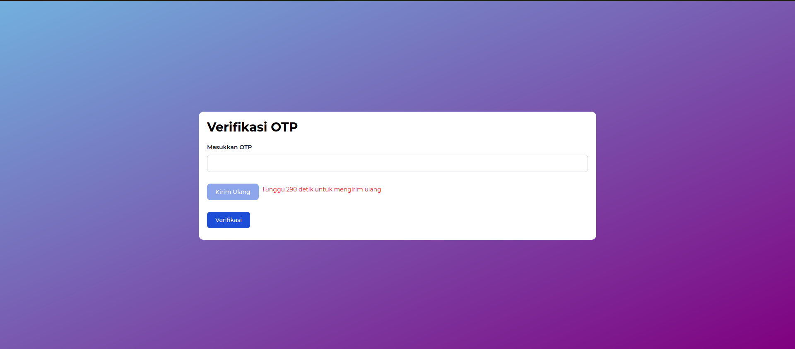
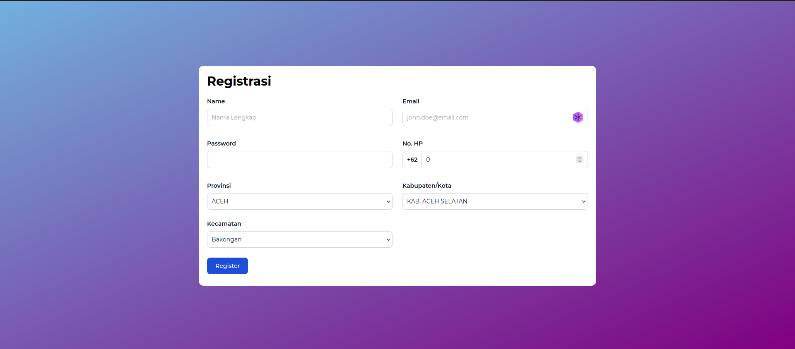

# Cara Menjalankan

1. Clone repository ini
2. Buka terminal dan arahkan ke folder repository ini
3. Install terlebih dahulu dengan `npm install` atau `yarn install`
4. Buat file `.env` dengan isi sesuai dengan `.env-example`
5. Build terlebih dahuulu dengan `npm run build` atau `yarn build`
6. Jalankan dengan `npm run start` atau `yarn start`
7. Atau jalankan dengan `npm run dev` atau `yarn dev` untuk mode development

# Screenshot

